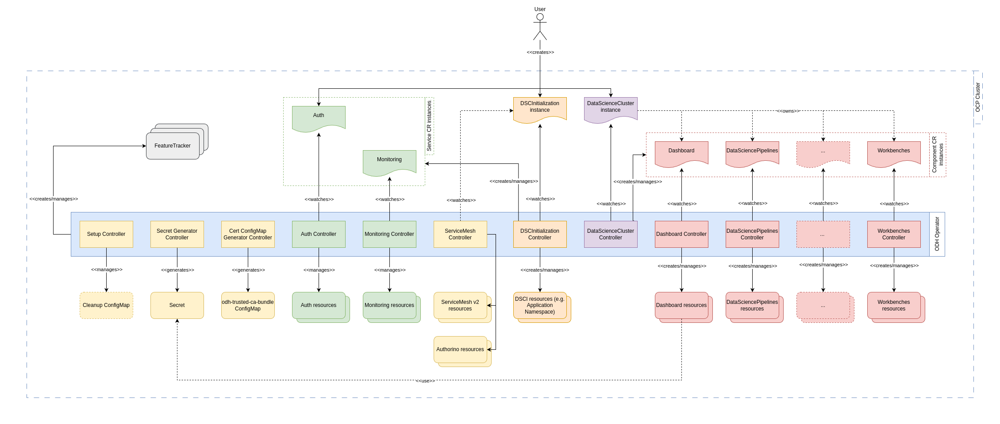

# Open Data Hub Operator Design

The following document outlines the current design of the Open Data Hub operator and the resources it manages.
The contents of this document reflect the changes brought by the ODH operator reconciliation refactor, introduced in December 2024. 

## Motivation

The current ODH operator design adheres to the following general goals:

- Create an opinionated deployment of ODH components.
- Provide the ability to enable/disable individual components.
- Provide users and cluster administrators with the ability to customize components.
  - include support for configuring target ODH component manifests via DevFlags.
- Provide the ability to reconcile individual ODH components using dedicated component controllers, instead of relying on a single controller/reconcile loop for everything.
  - improve scalability, separation of concerns/modularity, and error handling/failure isolation.
- Improve operator performance.
  - utilize proper caching mechanisms, parallelism and by avoiding bottlenecks.
- Provide the ability to easily clean up the cluster in a non-destructive way after ODH uninstallation.
- Improve visibility of the ODH platform state.
  - adopt status conditions.
  - improve logging and troubleshooting and debugging capabilities for ODH deployments.
- Provide support for configuring auth and monitoring at the ODH platform level.
- Provide support for easier integration of future ODH components and services.

## Custom Resources managed by the ODH operator

To deploy ODH components seamlessly, the ODH operator watches two [user-facing custom resources (CRs)](#user-facing-custom-resources-and-their-controllers) - **DSCInitialization** and **DataScienceCluster** – which are together responsible for ODH configuration and component setup.

In addition, each ODH component is represented by its own dedicated internal API/custom resource.
Each component CR singleton instance and its sub-resources are managed by a dedicated component controller.
More details on the supported ODH components are provided [here](#component-crs-and-controllers).

The operator also watches [Feature Trackers](#feature-trackers) which are cluster-scoped resources, specifically designed for monitoring and managing objects created via the internal Features API.

Furthermore, there are dedicated [service CRs and controllers](#service-crs-and-controllers) for configuring authentication and monitoring.

Lastly, the ODH operator also manages [accessory controllers](#accessory-controllers) responsible for helper tasks, such as secret generation and cleanup after uninstallation.

A high-level diagram showcasing the majority of the above-mentioned CRs and their reconcilers is provided below.



### User-facing Custom Resources and their controllers

The user-facing CRs are **DSCInitialization** (DSCI) and **DataScienceCluster** (DSC), along with **Auth** CR.
Together, these CRs are responsible for configuration of ODH at the platform level.

#### DSCInitialization (DSCI)

- DSCI CR is managed by the ODH operator to perform initial setup that is common for all components.
  - for example, DSCI defines the namespace for ODH component deployments, monitoring config, ServiceMesh config,...
- Some examples of initial setup include creating namespaces, network policies, common configmaps and secrets.
- DSCI instance is a singleton in the cluster, i.e., only one instance of this CR can be present in the cluster.
- DSCI controller implementation can be found in `internal/controller/dscinitialization` directory.

#### DataScienceCluster (DSC)

- DSC CR is watched by the ODH operator and serves as a single point to configure and enable various ODH components.
- It is responsible for enabling support for CRDs like Dashboard, Workbenches, DataSciencePipelines, etc.
- Like with DSCI, DSC instance is also a singleton in the cluster. A user can update the CR to enable/disable components.
- DSC controller implementation can be found in `internal/controller/datasciencecluster` directory.
- Detailed API fields are described in the CRD. Example DSC configurations are provided in the [Examples section](#examples).

#### Auth

- described in [Service CRs section](#service-crs-and-controllers).

### Component CRs and controllers

The ODH operator reconciliation refactor introduced dedicated CRDs for each ODH component.
From there, if enabled, an ODH component is represented by its dedicated singleton CR instance and the owned subresources, all of which are managed by a dedicated component controller. Component CRs are owned by the DSC.
The component controller implementations are located in the subdirectories of `internal/controller/components` directory.
 
List of currently integrated ODH components:

| **ODH Component** | **CR Kind** |
| --- | --- |
| ODH Dashboard | `Dashboard` |
| Data Science Pipelines | `DataSciencePipelines` |
| Feature Store (Feast) | `FeastOperator` |
| KServe | `Kserve` |
| Kueue | `Kueue` |
| Model Registry | `ModelRegistry` |
| Ray | `Ray` |
| Training Operator | `TrainingOperator` |
| TrustyAI | `TrustyAI` |
| Workbenches (IDEs) | `Workbenches` |


Component reconciliation refactor introduced a generic component reconciler builder and a CLI tool for generating the necessary files, making it easier to integrate new components in the future.
For more details, please refer to the [Component integration guide](https://github.com/opendatahub-io/opendatahub-operator/blob/main/docs/COMPONENT_INTEGRATION.md).

### Feature Trackers

A `FeatureTracker` represents a cluster-scoped resource, specifically designed for monitoring and managing objects created via the internal Features API.
This resource serves a crucial role in cross-namespace resource management, acting as an owner reference for various resources.
The primary purpose of the `FeatureTracker` is to enable efficient garbage collection by Kubernetes.
This is essential for ensuring that resources are automatically cleaned up and reclaimed when they are no longer required.

### Service CRs and controllers

In addition to the previously-mentioned CRs and their controller, the operator also manages the following ODH service CRs:
- `Auth`
  - user-facing CR
  - responsible for auth configuration
  - singleton instance in the cluster
  - controller implementation located in `internal/controller/services/auth` 
- `Monitoring`
  - responsible for monitoring configuration
  - singleton instance in the cluster
  - controller implementation located in `internal/controller/services/monitoring`

### Accessory controllers

The ODH operator currently manages several accessory controllers that handle parts of its functionality.
The currently used accessory controllers are listed below:
- Cert ConfigMap Generator controller
  - responsible for generating the ConfigMap with certificates (`odh-trusted-ca-bundle`), which includes cluster-wide trusted-ca bundle and custom ca bundle in every new namespace created.
  - controller implementation located in `internal/controller/services/certconfigmapgenerator`.
- Secret Generator controller
  - responsible for generating Secret used by the ODH Dashboard.
  - controller implementation located in `internal/controller/services/secretgenerator`.
- ServiceMesh controller
  - responsible for configuring ServiceMesh v2 and Authorino related resources.
  - controller implementation located in `internal/controller/services/servicemesh`.
- Setup controller
  - responsible for managing the ConfigMap that triggers the cleanup/uninstallation of ODH.
  - handles the cleanup logic itself.
  - controller implementation located in `internal/controller/services/setup`.

## Examples

1. Enable all components in DataScienceCluster

```console
apiVersion: datasciencecluster.opendatahub.io/v1
kind: DataScienceCluster
metadata:
  name: example
spec:
  components:
    dashboard:
      managementState: Managed
    datasciencepipelines:
      managementState: Managed
    kserve:
      nim:
        managementState: Managed
      rawDeploymentServiceConfig: Headless
      serving:
        ingressGateway:
          certificate:
            type: OpenshiftDefaultIngress
        managementState: Managed
        name: knative-serving
    modelmeshserving:
      managementState: Managed
    modelregistry:
      managementState: Managed
      registriesNamespace: "odh-model-registries"
    ray:
      managementState: Managed
    kueue:
      managementState: Managed
    trainingoperator:
      managementState: Managed
    workbenches:
      managementState: Managed
    trustyai:
      managementState: Managed
    feastoperator:
      managementState: Managed
    llamastackoperator:
      managementState: Removed
```

2. Enable only Dashboard and Workbenches(Jupyter Notebooks) in DataScienceCluster

```console
apiVersion: datasciencecluster.opendatahub.io/v1
kind: DataScienceCluster
metadata:
  name: example
spec:
  components:
    dashboard:
      managementState: Managed
    workbenches:
      managementState: Managed
```
