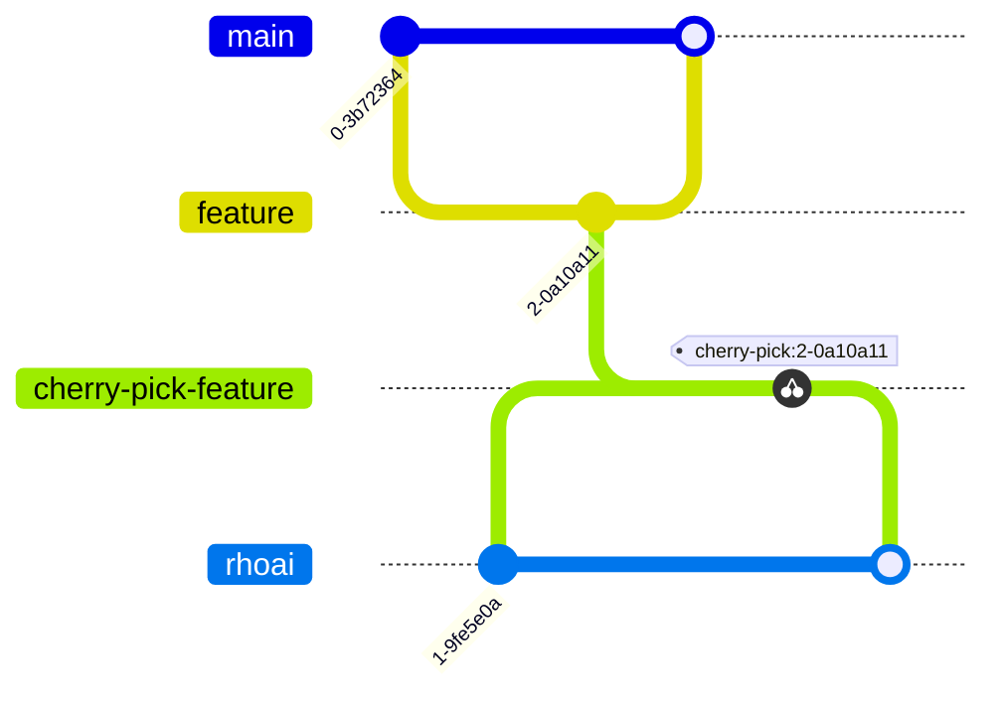

# OpenDataHub (ODH) Operator Release and Branching Process

This document provides an overview of the release process followed in the OpenDataHub (ODH) operator development lifecycle. It explains how upstream and downstream repositories are managed, including the branching strategy, code synchronization, and backporting workflows.

## Repositories Overview

The OpenDataHub operator development and release process spans two main repositories:

* **Upstream Repository:** [opendatahub-io/opendatahub-operator](https://github.com/opendatahub-io/opendatahub-operator)
* **Downstream Repository:** [red-hat-data-services/rhods-operator](https://github.com/red-hat-data-services/rhods-operator)

## Upstream Development and Release Workflow

There are two long-lived branches:

* `main` the primary development branch where all changes land first
* `rhoai` the branch tracking downstream (productization) changes

### Main Branch Overview

* All new features and bug fixes are first merged into the `main` branch.

### RHOAI Branch Overview

* A dedicated `rhoai` branch exists to track downstream-related changes.

### Release Branches Overview

* Release branches (`odh-x.y`, e.g., `odh-2.26.0`) are created from the `main` branch when a new upstream release is planned.

### Basic Upstream Workflow for the Operator

Changes to the operator should land in both `main` and the downstream `rhoai` branch.

1. **Merge PR to `main`**. Follow the process in [CONTRIBUTING.md](../CONTRIBUTING.md).
2. **Create a downstream sync PR:**
The PR author should then create another PR targeting the `rhoai` branch. CI automation typically creates the cherry-pick PR. Add a `/cherry-pick rhoai` comment to the original PR; CI will report success or failure. If it fails, manually cherry-pick the commits into a new branch and open a new PR.
3. **Edit the cherry-pick PR:** Edit the title to include the prefix `[sync]`. If the PR is associated with any Jira
ticket, edit the description to include the ticket link.
4. **Merge sync PR:**
After the sync PR has passed GitHub checks and is reviewed and approved, CI will merge it into the `rhoai` branch.

## Downstream Development and Release Workflow

### Main Branch Overview

* Changes from the upstream `rhoai` branch are synced into the downstream `main` branch.

### Release Branches Overview

* From the downstream `main` branch, changes are backported to release-specific branches (`rhoai-x.y`,  e.g., `rhoai-2.21`).
* These branches represent versions that are under active development or maintenance.

### Basic Downstream Workflow for the Operator

A change that lands in the odh-operator `main` branch ends up in the next `rhoai-x.y` branch as follows:

1. CI automation periodically merges the opendatahub-operator `rhoai` branch into the rhods-operator `main` branch.
2. CI automation periodically merges the rhods-operator `main` branch into the active rhods-operator `rhoai-x.y` release branch.

### Code Freeze and Z-Stream Overview

If a change is needed in a frozen/z-stream downstream release branch, an engineer opens a pull request against that specific release branch.
The following illustration shows the three stages of downstream branches:

* `rhoai-2.22` – Active development branch
* `rhoai-2.21` – Frozen branch in blocker-only phase
* `rhoai-2.19` – Released branch receiving only z-stream (critical) fixes

1. Automatic backports from `main` to `rhoai-2.21` are stopped.
2. A new development branch such as `rhoai-2.22` is created, which starts receiving backports from `main`.
3. `rhoai-2.21` becomes a frozen branch, entering the **blocker-only phase**, where only critical, approved fixes are permitted.
4. Any fix targeting `rhoai-2.21` must be approved as a blocker.
5. Older branches (e.g., `rhoai-2.19`) represent previously released versions and are maintained through z-stream (micro) releases, which accept only critical fixes.
6. These frozen/z-stream fixes are typically cherry-picked manually from the `main` branch to the appropriate branches.

## ODH Release Process(community)

The Open Data Hub (ODH) follows a **3-week release cycle**. This document outlines the standard steps involved in preparing and executing an ODH release.

> Remember to notify this [slack channel](https://odh-io.slack.com/archives/C05RJFT0DT5) regarding any updates/issues regarding the release.

### Tracker issue

At the **beginning of the week (Monday)** following the release cycle, each team must:

- Post a **comment** on the tracker issue (created for every release).
- The comment must include:
  - **Component name**
  - **Branch**
  - **Tag details**

> **Note**: The comment format must comply with the expected structure to be parsed by the release automation tools(Mentioned in the tracker issue).

The **actual release** occurs on the **following Tuesday**.

### Release Automation

A set of workflows/tasks using **GitHub Actions (GHA)** and **Konflux Pipelines** assists in automating the release process:

#### 1. Triggering `release-staging` Workflow

In the operator repository:

- Trigger the [`release-staging`](.github/workflows/release-staging.yaml) GHA workflow by providing:
  - **Tracker issue URL** eg: https://github.com/opendatahub-io/opendatahub-community/issues/176
  - **Release version** eg: 2.30.0(Strictly semver)

This workflow:

- Reads the tracker issue
- Generates a **pull request targeting the `main` branch**
  - Updates to maifests with version and other details
  - Adds a comment regarding the tracker issue url and version
- Pushes a commit to the `odh-x.y.z` **release branch**, including:
  - Changes to `get_all_manifests.sh`
  - Updates to manifests with version and other details.

### Chained Workflows

#### `odh-konflux-central`: `odh-konflux-release-onboarder`

This workflow is triggered by the release-staging workflow and it:

- Creates a PR to the **release branch**
- Adds the **Tekton files** required for the Konflux build process

#### Konflux Build

Once the above PR is merged, the Konflux pipeline starts and:

- **Builds the operator image**
- **Builds the operator bundle**

> The initial bundle build will fail as there will be no catalog.yaml present, the next step will take care of the failure by generating the catalog and retriggering the catalog build.

#### `opendatahub`: [`fbc-processor`](https://github.com/opendatahub-io/opendatahub/blob/main/.github/workflows/fbc-processor.yaml)

Triggered at the end of the operator bundle pipeline:

- Generates `catalog.yaml` required for the catalog build
- Pushes commit to the **release branch**
- Initiates a Konflux build to create the **catalog image**

### QE Sign-Off

The **Quality Engineering (QE)** team performs:

- A set of **ODS-CI tests** using the catalog image generated from the above step
- Once QE provides **final sign-off**, the release can proceed

### Final Release Steps

The release is done in **two parts**:

#### 1. GitHub Pre-release

- Use a [GHA workflow](https://github.com/opendatahub-io/opendatahub-operator/blob/main/.github/workflows/release.yaml) to trigger a **GitHub release**. This is done automatically when the PR to the main branch is merged.
- This generates changelogs and sets the release in **pre-release** state

#### 2. OperatorHub Release

- Create a PR to the [`community-operators-prod`](https://github.com/redhat-openshift-ecosystem/community-operators-prod) repository with updated manifests ([example PR](https://github.com/redhat-openshift-ecosystem/community-operators-prod/pull/6646))
- Once merged:
  - Set the GitHub release to **final (latest) state**

### Tracker Closure

- Update and **close the tracker issue** with:
  - Link to the merged PR in `community-operators-prod` ([example comment](https://github.com/opendatahub-io/opendatahub-community/issues/175))

 **ODH Release Process is now complete.**

## Summary

* The overall process involves **four branches** across two repos.
* First, a change lands in the [opendatahub-io/opendatahub-operator](https://github.com/opendatahub-io/opendatahub-operator) repo according to the [Basic Upstream Workflow](#basic-upstream-workflow-for-the-operator).
* Then, downstream work happens in the [red-hat-data-services/rhods-operator](https://github.com/red-hat-data-services/rhods-operator) repo according to the [Basic Downstream Workflow](#basic-downstream-workflow-for-the-operator).
