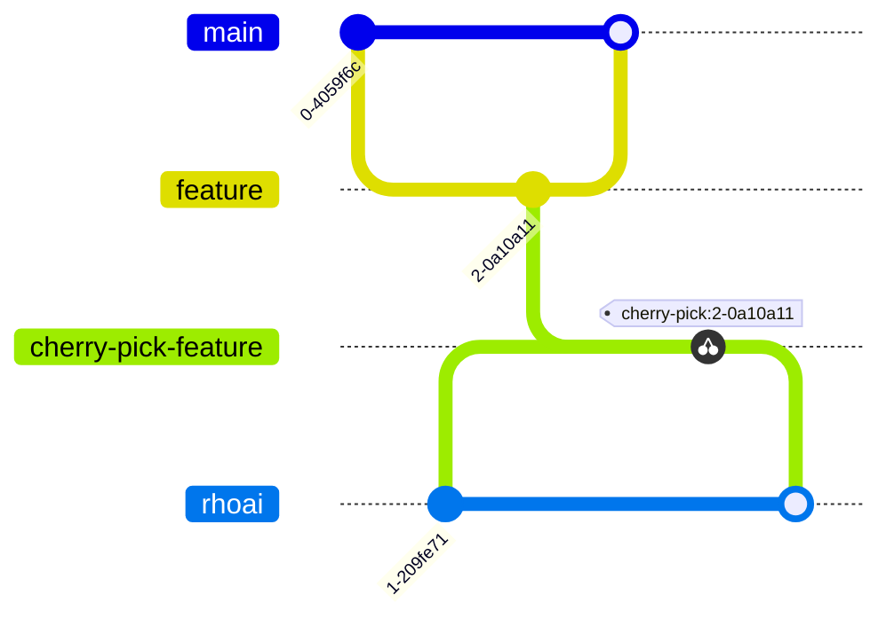

# Basic workflow for Operator

There are two long-lived branches:

- `main` the primary development branch where all changes land first
- `rhoai` the branch tracking downstream (productization) changes

Changes to the operator should land in both `main` and the downstream `rhoai` branch.

1. **Merge PR to `main`**. Follow the process in [CONTRIBUTING.md](../CONTRIBUTING.md).

2. **Create a downstream sync PR:**
The PR author should then create another PR targeting the `rhoai` branch. CI automation can usually create the
cherry-pick PR. Add a `/cherry-pick rhoai` comment to the original PR. CI will comment success or failure. If it fails,
you must manually cherry-pick commits to a new cherry-pick branch and manually open a new PR.

3. **Edit the cherry-pick PR:** Edit the title to include the prefix `[sync]`. If the PR is associated with any Jira
ticket, edit the description to include the ticket link.

4. **Merge sync PR:**
After the sync PR has passed github checks and is reviewed and approved, CI will merge it into `rhoai` branch.

## Merging Changes Downstream

The overall process involves four branches across two repos.

First, a change lands in the opendatahub-operator repo according to the basic workflow above.

Then, downstream work happens in the [red-hat-data-services/rhods-operator](https://github.com/red-hat-data-services/rhods-operator)
repo.

A change that lands in the odh-operator `main` branch ends up in the next `rhoai-x.y` branch as follows:

1. CI automation periodically merges the opendatahub-operator`rhoai` branch into the rhods-operator `main` branch.
2. CI automation periodically merges the rhods-operator `main` branch into the active rhods-operator `rhoai-x.y` release branch.

If a change is needed in a frozen/z-stream downstream release branch, an engineer opens a pull request against that specific
release branch.

1. Frozen branches are for an upcoming downstream release, where automatic merging is disabled for stabilization. For a
   frozen branch, pull requests are appropriate for blocker issues only.
2. Older release branches are used for z-stream fixes, where we provide critical fixes to the released product.
