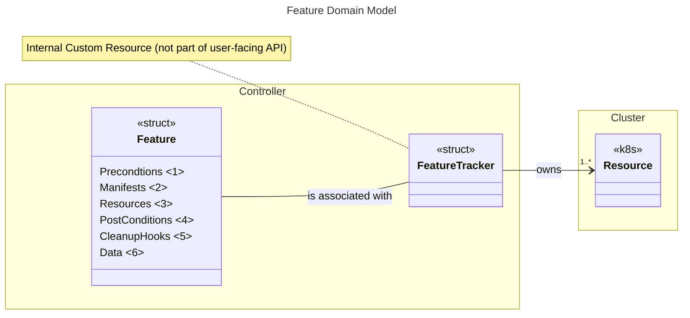
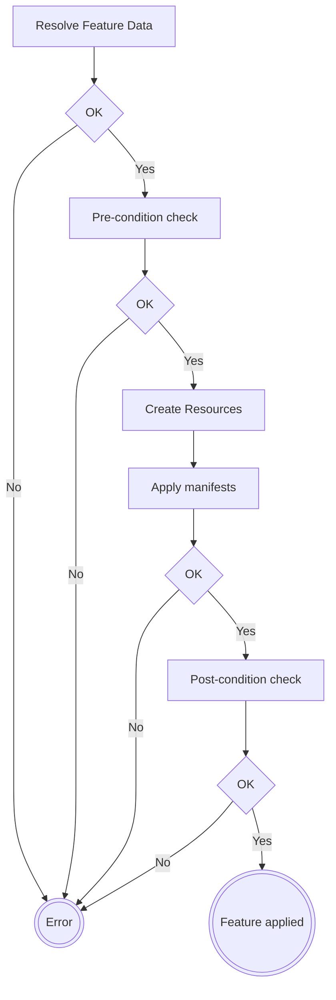

# Feature DSL

`Feature` struct encapsulates a set of resources to be created and actions to be performed in the cluster in order to enable desired functionality. For example, this could involve deploying a service or configuring the cluster infrastructure necessary for a component to function properly.

## Goals

- Abstraction for self-contained units of desired changes in the cluster.
- Granular control of resource management.
- Intuitive way of defining desired cluster changes in the controller code.
- Support both programmatic and declarative means of changing cluster state.
- Detailed status reporting enables quick diagnosis of issues.

## Overview



- `<1>` Preconditions which are needed for the feature to be successfully applied (e.g. existence of particular CRDs)
> [!NOTE] 
> Although not strictly required due to the declarative nature of Kubernetes, it can improve error reporting and prevent the application of resources that would lead to subsequent errors.
- `<2>` Manifests (i.e. YAML files) to be applied on the cluster. These can be arbitrary files or Go templates.
- `<3>` Programmatic resource creation required by the feature.
- `<4>` Post-creation checks, for example waiting for pods to be ready.
- `<5>` Cleanup hooks (i.e. undoing patch changes)
- `<6>` Data store needed by templates and actions (functions) performed during feature's lifecycle.

## Creating a Feature

### Getting started

The easiest way to define a feature is by using the Feature Builder (builder.go), which provides a guided flow through a fluent API, making the construction process straightforward and intuitive.

```go
smcp, errSMCPCreate := feature.Define("mesh-control-plane-creation").
	TargetNamespace("opendatahub").
	ManifestsLocation(Templates.Location).
	Manifests(
		path.Join(Templates.ServiceMeshDir),
	).
	WithData(
		servicemesh.FeatureData.ControlPlane.Create(&dsci.Spec).AsAction(),
	).
	PreConditions(
		servicemesh.EnsureServiceMeshOperatorInstalled,
		feature.CreateNamespaceIfNotExists(serviceMeshSpec.ControlPlane.Namespace),
	).
	PostConditions(
		feature.WaitForPodsToBeReady(serviceMeshSpec.ControlPlane.Namespace),
	).
	Create()
```

For more examples have a look at `integration/feature` tests.

### Using dynamic values

It may be necessary to supply data that is only available at runtime, such as cluster configuration details. For this purpose, a `DataProviderFunc` can be utilized.

```go
WithData(
    feature.Entry("Domain", func (ctx context.Context, c client.Client) (string, error) {
		//... fetch the data somehow
		return domain, nil
    }),
)
```

Default values can be applied when an expected field in the struct is "empty" by using utilities from the provider package, for example:

```go
WithData(
    feature.Entry("Secret", provider.ValueOf(spec.SecretName).OrElse(DefaultCertificateSecretName),
)
```

For more on how to further simplify re-use of Feature's context data see a [dedicated section about conventions](#feature-context-re-use).

## Execution flow 

The diagram below depicts the flow when Feature is applied.



## Feature Tracker

`FeatureTracker` is an internal CRD, not intended to be used in user-facing API. Its primary goal is to establish ownership of all resources that are part of the given feature. This way we can transparently
garbage collect them when feature is no longer needed.

Additionally, it updates the `.status`  field with detailed information about the Feature's lifecycle operations. This can be useful for troubleshooting, as it indicates which part of the feature application process is failing.

## Managing Features with `FeaturesHandler`

The `FeaturesHandler` (`handler.go`) provides a structured way to manage and coordinate the creation, application, and deletion of features needed in particular Data Science Cluster configuration such as cluster setup or component configuration.

When creating a `FeaturesHandler`, developers can provide a FeaturesProvider implementations. This allows for the straightforward registration of a list of features that the handler will manage.

## Conventions

### Templates

Golang templating can be used to create (or patch) resources in the cluster which are part of the Feature. Following rules are applied:

* Any file which has `.tmpl.` in its name will be treated as a template for the target resource.
* Any file which has `.patch.` in its name will be treated a patch operation for the target resource.

By convention, these files can be stored in the resources folder next to the Feature setup code, so they can be embedded as an embedded filesystem when defining a feature, for example, by using the Builder. 

Anonymous struct can be used on per feature set basis to organize resource access easier:

```go
//go:embed resources
var resourcesFS embed.FS

const baseDir = "resources"

var Resources = struct {
	// InstallDir is the path to the Serving install templates.
	InstallDir string
	// Location specifies the file system that contains the templates to be used.
	Location fs.FS
	// BaseDir is the path to the base of the embedded FS
	BaseDir string
}{
	InstallDir:     path.Join(baseDir, "installation"),
	Location:       resourcesFS,
	BaseDir:        baseDir,
}
```

### Feature context re-use

The `FeatureData` anonymous struct convention provides a clear and consistent way to manage data for features.

By defining data and extraction functions, it simplifies handling of feature-related data in both templates and functions where this data is required. 

```go
const (
	servingKey  = "Serving" // <1>
)

var FeatureData = struct {
	Serving       feature.DataDefinition[infrav1.ServingSpec, infrav1.ServingSpec] // <2>
}{
	Serving: feature.DataDefinition[infrav1.ServingSpec, infrav1.ServingSpec]{
		Define /*<3>*/: func(source *infrav1.ServingSpec) feature.DataEntry[infrav1.ServingSpec] {
			return feature.DataEntry[infrav1.ServingSpec]{
				Key:   servingKey,
				Value: provider.ValueOf(*source).Get,
			}
		},
		Extract /*<4>*/: feature.ExtractEntry[infrav1.ServingSpec](servingKey),
	},
}
```
- `<1>` Key used to store defined data entry in the Feature's context. This can be later used in templates as well as golang functions.
- `<2>` Generic struct used to define how context entry is created. Parametrized types hold information about the source and target types. The source type represents the origin from which data is taken, defining the type of data being input or extracted from the source. The target type determines the type of the value that will be stored in the key-value store (feature context data).
- `<3>` Defines how an entry (key-valaue) is created and stored in Feature's context.
- `<4>` Defines how to extract the value from the context (typed access instead of relying on string keys).

Example below illustrates both storing data in the feature and accessing it from Feature's action function:

```go
// Define the feature using builder
// ...
WithData(serverless.FeatureData.Serving.Define(servingSpec).AsAction())
// ...

// To extract in the action function
func DoSomethingWithServingData(f *feature.Feature) (string, error) {
    serving, err := FeatureData.Serving.Extract(f);
    if err != nil {
        return "", err
    }
    // do something with serving data - create a resource, etc.
    // ....
}
```
> [!NOTE]
> Calling `.AsAction()` is a workaround due to limitation of generic on receiver functions

